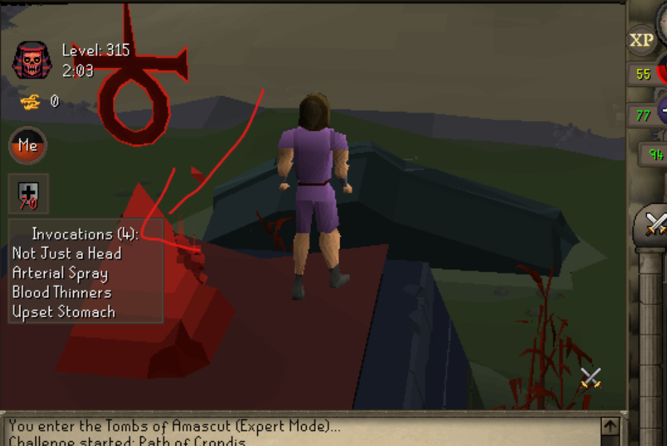
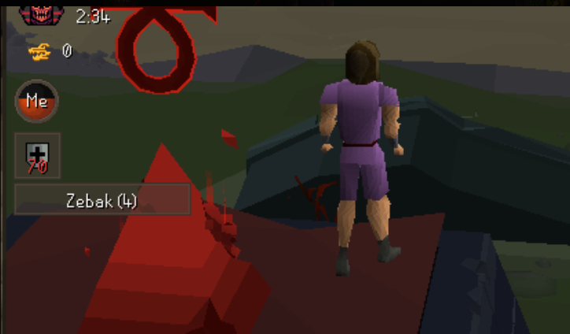

# ToA Invocations

RuneLite plugin that shows the active invocations relevant to each boss room when you enter it.

## Screenshots

Names mode | Count mode
:---:|:---:
 | 

## Features

- Shows only invocations specific to the current boss (Kephri, Zebak, Akkha, Ba-Ba, Wardens)
- Two display modes: full names list or count only

## Config

| Option | Description |
|--------|-------------|
| Display Mode | `NAMES` — lists active invocations. `COUNT_ONLY` — shows just the count (e.g. `Zebak (4)`) |
